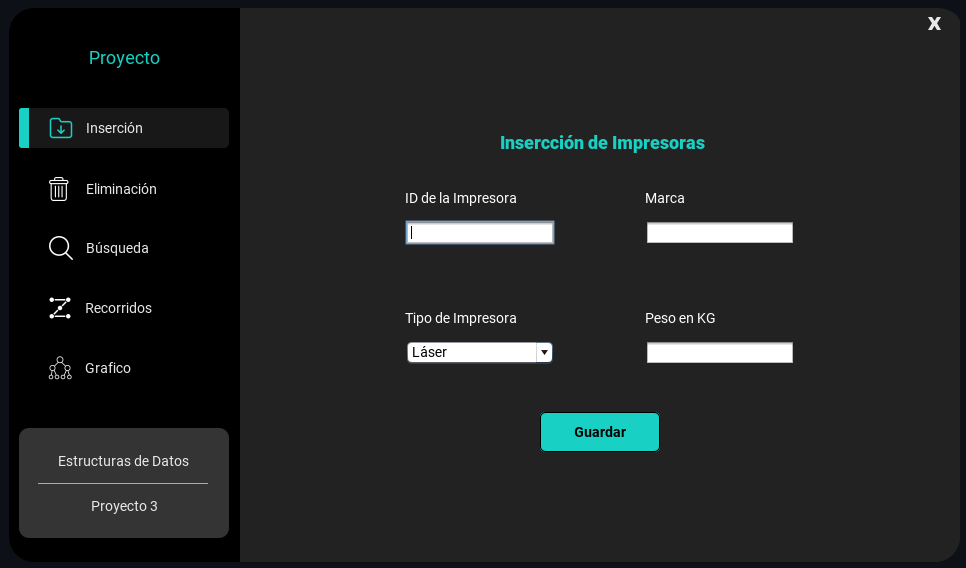
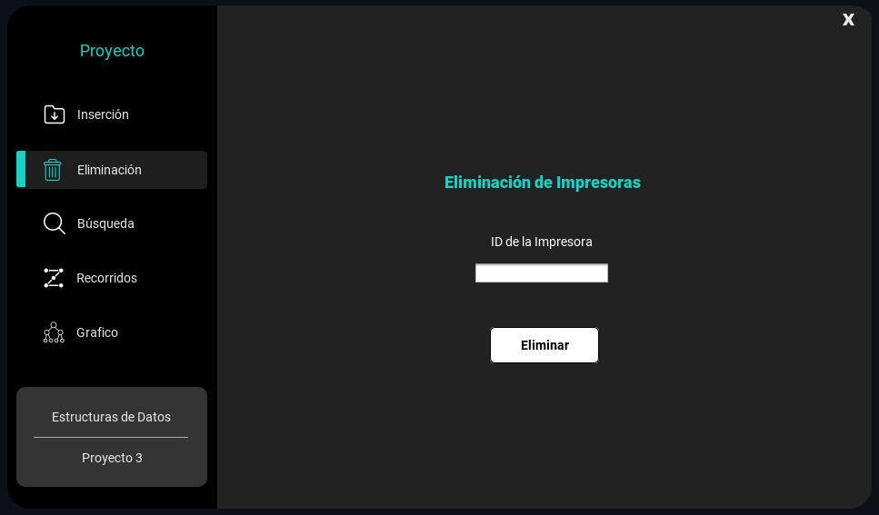
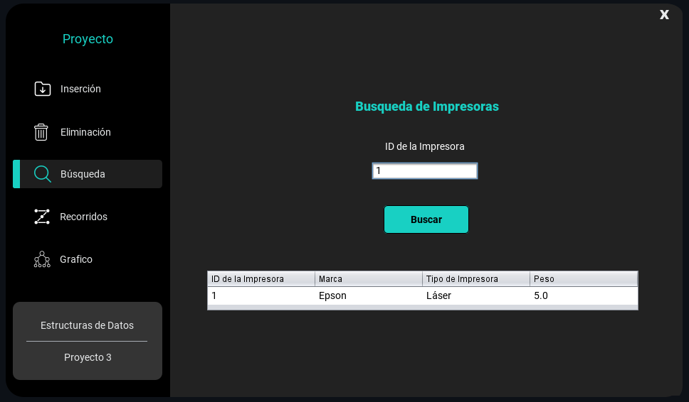
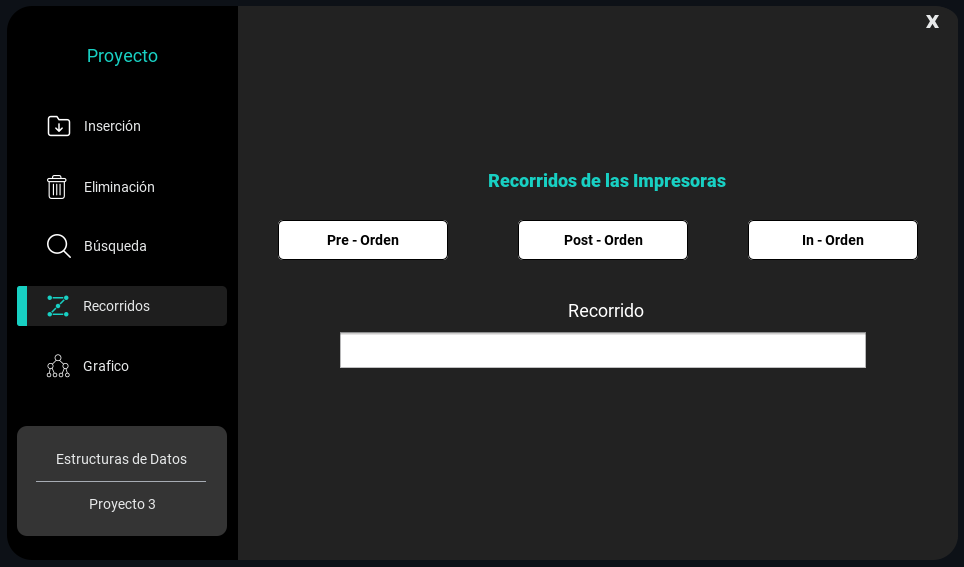
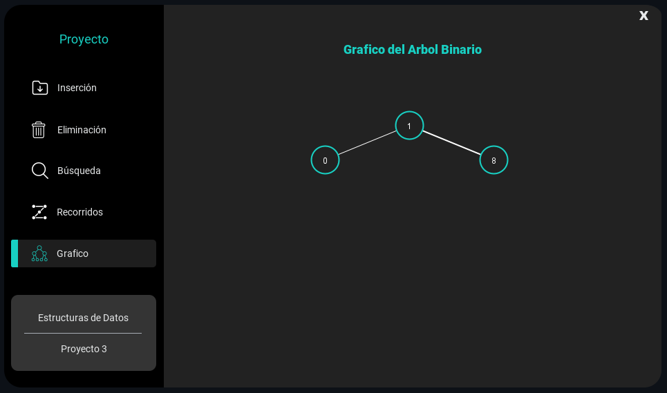

<div align="center">

# 🌳 Binary Search Tree Visualizer

### Interactive desktop application for exploring Binary Search Tree operations

A Java application that allows users to **insert, delete, search, traverse, and visually represent nodes in a Binary Search Tree** through a graphical interface.

<br>


</div>

---

## 📌 About the Project

**Binary Search Tree Visualizer** is a desktop application developed in Java as part of the **Data Structures** course at Universidad Estatal a Distancia (UNED), during the second academic term of 2024.

The project implements the core operations of a **Binary Search Tree (BST)** and provides a graphical interface that makes it possible to visualize how the tree changes as nodes are inserted or removed.

The application focuses on applying data structure concepts through an interactive implementation rather than only representing them theoretically.

---

## ✨ Features

### ➕ Node insertion

Adds new nodes to the Binary Search Tree while validating duplicate IDs.

<div align="center">



</div>

---

### ➖ Node deletion

Supports the three standard deletion scenarios:

* Leaf node.
* Node with one child.
* Node with two children.

<div align="center">



</div>

---

### 🔎 Node search

Searches the tree using a node ID and displays the stored information when a match is found.

<div align="center">



</div>

---

### 🔄 Tree traversals

Supports the main Binary Search Tree traversal algorithms:

* **In-order**
* **Pre-order**
* **Post-order**

<div align="center">



</div>

---

### 🌳 Tree visualization

Generates a graphical representation of the current tree structure, making parent-child relationships easier to understand.

<div align="center">



</div>

---

## 🧠 Concepts Applied

This project applies fundamental computer science concepts such as:

* Binary Search Trees.
* Recursive algorithms.
* Tree traversal algorithms.
* Node insertion and deletion.
* Search algorithms.
* Object-Oriented Programming.
* Data validation.
* Graphical User Interfaces.

---

## 🛠️ Tech Stack

| Area           | Technology         |
| -------------- | ------------------ |
| Language       | Java               |
| GUI            | Java Swing         |
| IDE            | Apache NetBeans    |
| Data Structure | Binary Search Tree |

---

## 🎥 Demo

A complete demonstration of the application is available inside the repository:

▶️ [View demo video](Demostración/Demo.mp4)

---

## 🚀 Run Locally

### 1. Clone the repository

```bash
git clone https://github.com/KendallCal/BinarySearchTreeVisualizer.git
```

### 2. Open the project

Open the project using **Apache NetBeans**.

### 3. Build and run

Compile and execute the application from the IDE.

### 4. Explore the tree

Use the graphical interface to:

* Insert nodes.
* Delete nodes.
* Search for nodes.
* Execute tree traversals.
* Visualize the resulting tree.

---

## 🎓 Academic Context

This project was developed for the **Data Structures** course at Universidad Estatal a Distancia de Costa Rica.

It provided practical experience implementing one of the fundamental data structures in computer science while combining algorithms, object-oriented programming, recursion, and graphical visualization.

---

<div align="center">

### 👨‍💻 Kendall Calderón

[](https://github.com/KendallCal)
[](https://www.linkedin.com/in/kendallcal/)
[](https://www.kendallc.dev/)

</div>
